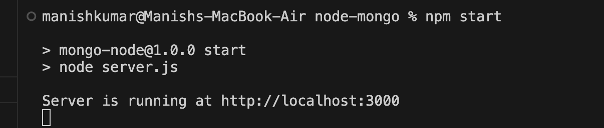
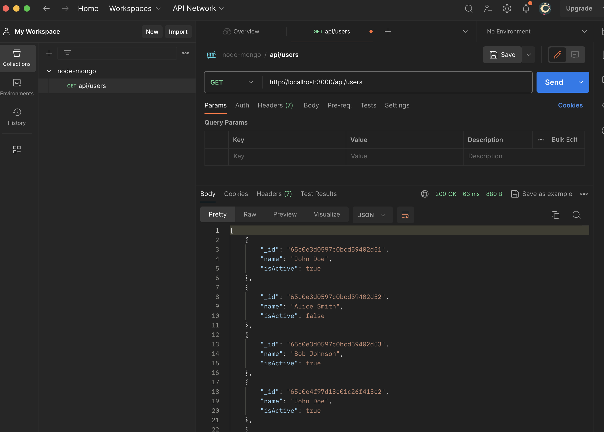

Certainly! To add screenshots to your README.md file, you can follow the template below:

```markdown
# Node.js and MongoDB Integration

This project demonstrates a basic Node.js server with an endpoint "/api/users" that connects to a MongoDB database and returns a JSON list of all users. The MongoDB database contains a collection named 'users' with fields such as 'name', 'email', and 'age'.

## Table of Contents

- [Installation](#installation)
- [Usage](#usage)
- [Endpoints](#endpoints)
- [Screenshots](#screenshots)
- [Contributing](#contributing)
- [License](#license)

## Installation

1. Install Node.js and npm if not already installed.

2. Clone the repository:

   ```bash
   git clone https://github.com/your-username/your-node-mongo-project.git
   ```

3. Navigate to the project directory:

   ```bash
   cd your-node-mongo-project
   ```

4. Install dependencies:

   ```bash
   npm install
   ```

## Usage

1. Start the server:

   ```bash
   node server.js
   ```

2. Access the list of users by visiting [http://localhost:3000/api/users](http://localhost:3000/api/users) in your browser or through API tools like curl or Postman.

## Endpoints

- `/api/users`: Retrieve a JSON list of all users from the MongoDB 'users' collection.

## Screenshots


*server running*


*api requests on Postman*

## Contributing

If you'd like to contribute, please fork the repository and create a pull request.

## License

This project is licensed under the [Your License] License - see the [LICENSE.md](LICENSE.md) file for details.
```

Ensure that you have a folder named `screenshots` in your project directory and replace `screenshot1.png` and `screenshot2.png` with the actual file names of your screenshots. Additionally, provide relevant captions for each screenshot.